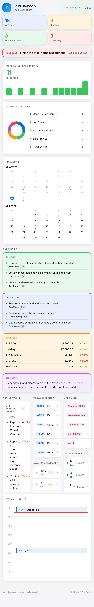

# Task Dashboard

A self-contained, Apple-style personal task dashboard generated from a plain Markdown task list and a small JSON data file. One Python script turns them into a single static HTML page you can host anywhere.

**[Live demo](https://felixuniversityca-svg.github.io/task-dashboard/)**



## Features

- KPI cards: active, blocked, done this week, due today (animated count-up).
- Donut chart of open tasks by project, with a tap-to-expand breakdown.
- 14-day completion sparkline.
- Two-month mini calendar with deadline dots.
- Hour-by-hour day view with a live current-time line.
- Tap-to-expand drawer on every widget with hierarchical drill-down.
- Live side widgets: upcoming deadlines, recent emails, today's agenda, awaiting-feedback, weekly progress, and a news/markets briefing.
- Fully responsive, no build step beyond one Python script, no runtime dependencies, no framework.

## Demo data

This repository ships with fictional data so the dashboard renders out of the box. `demo/Tasks.md` and `demo/dashboard-data.json` are made-up: the projects, people, emails, deadlines, and market quotes are all invented for the demo. Point the script at your own files to make it yours.

## How it works

1. `demo/Tasks.md` holds tasks in a simple Markdown format:
   - Active task: `- [ ] Task text <!-- due: YYYY-MM-DD --> <!-- time: HH:MM --> <!-- duration: 1h30 -->`
   - Blocked task: `- [ ] Task -- waiting: Person -- since YYYY-MM-DD`
   - Completed task: `- [x] Task ✅ YYYY-MM-DD`
   - Section headers group tasks into project cards. A header like `### Project / Subsection` groups subsections under one project.
2. `demo/dashboard-data.json` holds the live-widget data (deadlines, emails, agenda, markets, news, etc.). In a real setup you would refresh this on a schedule.
3. `build.py` reads both files and emits `docs/index.html`, a single static page.

```bash
python3 build.py
open docs/index.html
```

The output is a single file in `docs/`, so it hosts on GitHub Pages, Netlify, Cloudflare Pages, or any static host with no server-side code.

## Tech

Python 3 standard library only (no third-party packages) to generate vanilla HTML, CSS, and JavaScript.

## License

MIT. See [LICENSE](LICENSE).
